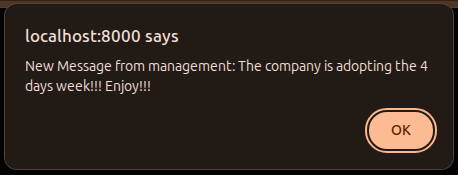

## Broadcasting with Private Channels

To broadcast an event to specific authenticated users, we can use Private Channels.

This is a simple example of internal company communication.

Let's generate an event class:

```sh
php artisan make:event CommunicationSent
```

This will generate a class. Let's apply a few small changes; the final class should be like this:

```php
<?php

namespace App\Events;

use Illuminate\Broadcasting\Channel;
use Illuminate\Broadcasting\InteractsWithSockets;
use Illuminate\Broadcasting\PresenceChannel;
use Illuminate\Broadcasting\PrivateChannel;
use Illuminate\Contracts\Broadcasting\ShouldBroadcastNow;
use Illuminate\Foundation\Events\Dispatchable;
use Illuminate\Queue\SerializesModels;

class CommunicationSent implements ShouldBroadcastNow
{
    use Dispatchable, InteractsWithSockets, SerializesModels;

    public $message;

    /**
     * Create a new event instance.
     */
    public function __construct(string $message)
    {
        $this->message = $message;
    }

    /**
     * Get the channels the event should broadcast on.
     *
     * @return array<int, \Illuminate\Broadcasting\Channel>
     */
    public function broadcastOn(): array
    {
        return [
            new PrivateChannel('private.communication'),
        ];
    }
}
```

The only difference in the backend class is the `PrivateChannel` class; public broadcasting uses `Illuminate\Broadcasting\Channel` instead.


Now, on the frontend, add this code to your Blade view.


```html
<script>
    document.addEventListener("DOMContentLoaded", () => {
        Echo.private('private.communication')
            .listen('CommunicationSent', (e) => {
                alert('New Message from management: ' + e.message);
        });
    });
</script>
```

To trigger this, execute:

```php
App\Events\CommunicationSent::dispatch("The company is adopting the 4 days week!!! Enjoy!!!")
```

You should see this message in the browser:



The same applies to the `private` method; public listeners use `channel` instead. This is the only difference in the code between the two broadcasting methods, but to use private broadcasting you must be logged in.

This is an easy example. To understand everything you can do and all broadcasting features, take a look at the [Laravel documentation](https://laravel.com/docs/12.x/broadcasting).
