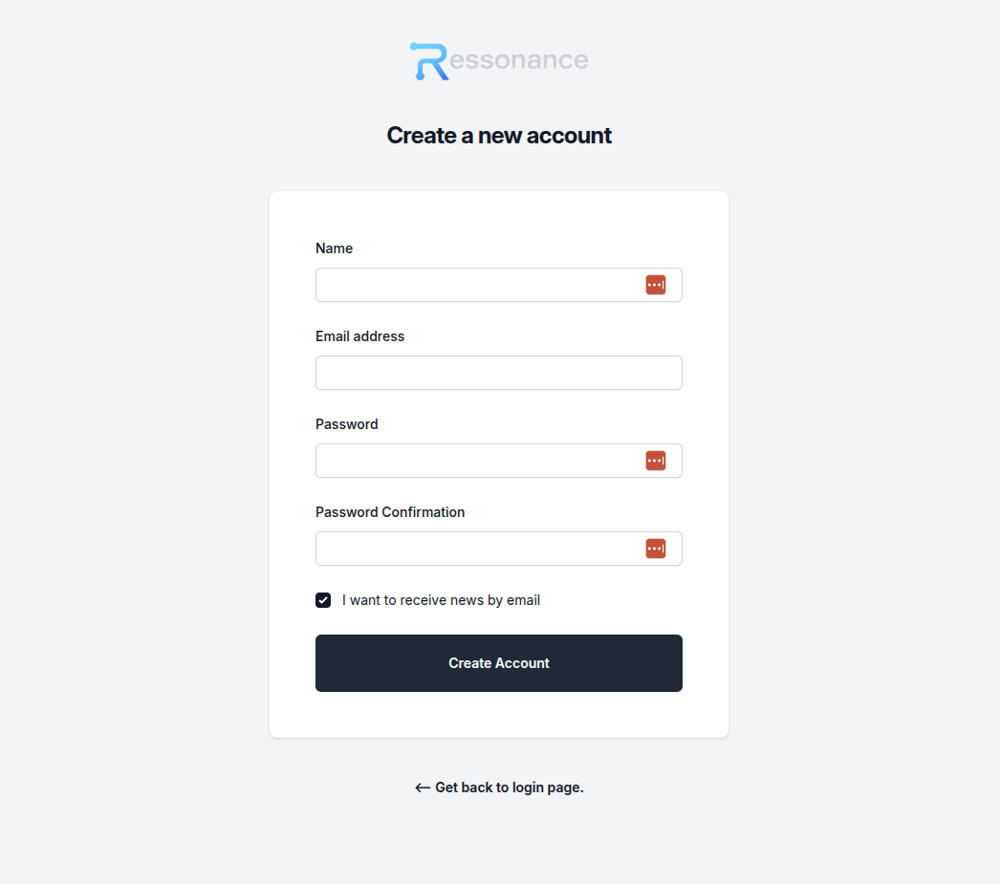
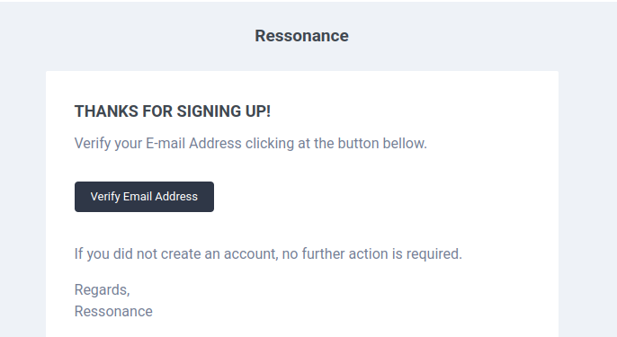

# Create Ressonance Cloud Account

To create an account, go to [https://app.ressonance.com/create-account](https://app.ressonance.com/create-account) and fill out the form with a valid email.

After you submit the form, you will receive a verification link at your email address. Click Verify to activate the account.

Now you are ready to create a Ressonance app.

**Note: If you do not receive the email, check the spam folder.**
