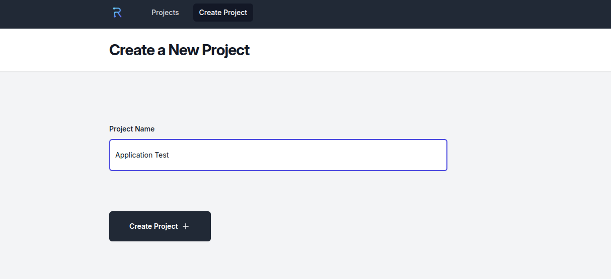
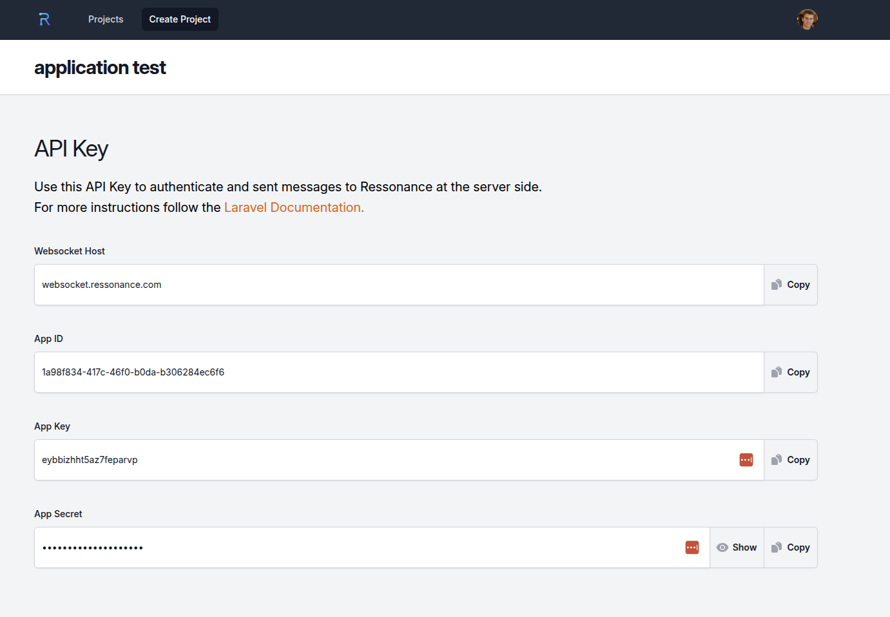

# Create Ressonance Application

After creating an account, create an application key inside Ressonance. You will use this key inside your application.

Click "Create Project" and your application key will be generated.

Use the app key with a Pusher-compatible API. For Laravel applications, you can use Reverb as described in the [Laravel broadcasting documentation](https://laravel.com/docs/11.x/broadcasting#client-reverb).
