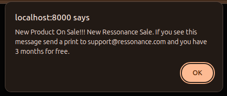

## Broadcasting with Public Channels

We can dispatch events from the backend to the frontend publicly. For example, when a new product is on sale, we want to notify every user on the website.

Let's generate an event class:

```sh
php artisan make:event NewProductOnSaleReleased
```

This generates a class. Let's apply a few small changes; the final class should be like this:

```javascript
<?php

namespace App\Events;

use Illuminate\Broadcasting\Channel;
use Illuminate\Broadcasting\InteractsWithSockets;
use Illuminate\Broadcasting\PresenceChannel;
use Illuminate\Broadcasting\PrivateChannel;
use Illuminate\Contracts\Broadcasting\ShouldBroadcastNow;
use Illuminate\Foundation\Events\Dispatchable;
use Illuminate\Queue\SerializesModels;

class NewProductOnSaleReleased implements ShouldBroadcastNow
{
    use Dispatchable, InteractsWithSockets, SerializesModels;

    public $productName;

    /**
     * Create a new event instance.
     */
    public function __construct(string $productName)
    {
        $this->productName = $productName;
    }

    /**
     * Get the channels the event should broadcast on.
     *
     * @return array<int, \Illuminate\Broadcasting\Channel>
     */
    public function broadcastOn(): array
    {
        return [
            new Channel('product.on.sale'),
        ];
    }
}
```

Now, on the frontend, add this code to your Blade view.


```html
<script>
    document.addEventListener("DOMContentLoaded", () => {
        Echo.channel('product.on.sale')
            .listen('NewProductOnSaleReleased', (e) => {
                alert('New Product On Sale!!!' + e.productName);
        });
    });
</script>
```

To trigger this, execute:

```javascript
App\Events\NewProductOnSaleReleased::dispatch("New Ressonance Sale. If you see this message send a print to support@ressonance.com and you have 3 months for free.")
```

You should see this message in the browser:



This is an easy example. To understand everything you can do and all broadcasting features, take a look at the [Laravel documentation](https://laravel.com/docs/12.x/broadcasting).

The next tutorial will show you a simple private channel.
