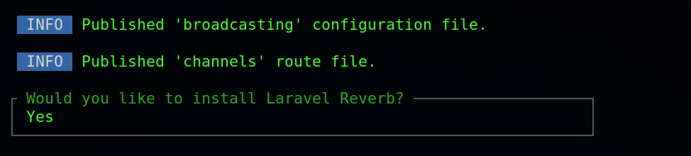
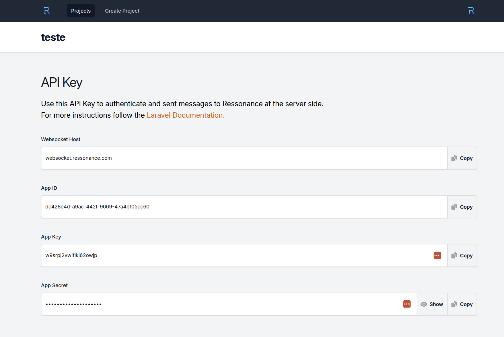

## Installing Reverb

Ressonance is a managed Reverb installation. To use Ressonance, the first step is to install Reverb in your application. Reverb installs the Reverb server and the Reverb client. We will not use the Reverb server because Ressonance will take its place. Run:

`php artisan install:broadcasting --reverb`

This will ask you to install Laravel Reverb. Say **yes** to all questions:



After the installation, you should see environment variables for the local Reverb installation similar to this:

```
REVERB_APP_ID=674307
REVERB_APP_KEY=ejiqpjhayx4q7jptyrzd
REVERB_APP_SECRET=lyzuim8dq06kfnxzrxbv
REVERB_HOST="localhost"
REVERB_PORT=8080
REVERB_SCHEME=http

VITE_REVERB_APP_KEY="${REVERB_APP_KEY}"
VITE_REVERB_HOST="${REVERB_HOST}"
VITE_REVERB_PORT="${REVERB_PORT}"
VITE_REVERB_SCHEME="${REVERB_SCHEME}"
```

To configure Ressonance correctly, change the values to point to the Ressonance WebSocket servers. [Create a Ressonance application](https://app.ressonance.com/dashboard/projects/create), and you should see a page like this:




After changing the values, you should have this configuration:

```
REVERB_APP_ID=dc428e4d-a9ac-442f-9669-47a4bf05cc60
REVERB_APP_KEY=w9srpj2vwjflkl62owjp
REVERB_APP_SECRET=cnmblmvwafyqdidd8ewg
REVERB_HOST="websocket.ressonance.com"
REVERB_PORT=443
REVERB_SCHEME=https

VITE_REVERB_APP_KEY="${REVERB_APP_KEY}"
VITE_REVERB_HOST="${REVERB_HOST}"
VITE_REVERB_PORT="${REVERB_PORT}"
VITE_REVERB_SCHEME="${REVERB_SCHEME}"
```

**If you are not using any queue system, make sure to keep QUEUE_CONNECTION=sync for this tutorial.**

This is all you need to do to integrate your Laravel application with Ressonance.
The next tutorials will walk you through broadcasting.

Take a look at the [Laravel documentation](https://laravel.com/docs/12.x/broadcasting) too; it much detailed instructions about reverb installation.
